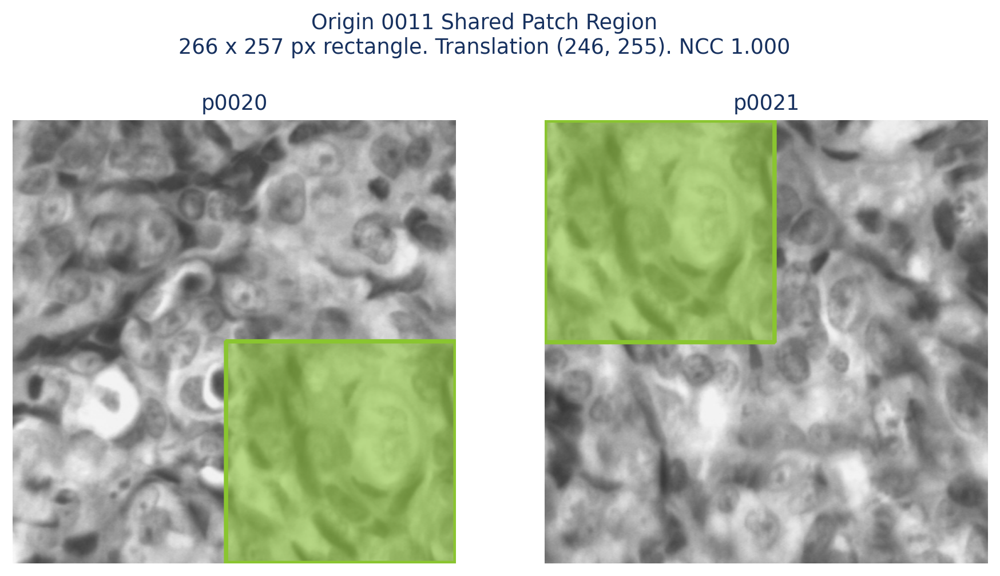

# Contamination Checks

<span class="status-pill">Paused</span>

This page records exploratory image-level checks for possible duplicate-like patches and origin-patch matching issues. The current documented example is Origin 0011. It is not a complete contamination disposition for the full dataset.

## Current Status

Human-in-the-loop validation is paused. All origin-patch pairs currently accepted into the matched fold-design set were visually checked by a human, but not all possible patches have been matched or dispositioned.

The current fold-generation pipeline remains usable because Phase 3 locks every patch from the same origin into the same fold. That prevents a known class of leakage even when patches from one origin look similar to each other.

## Example: Origin 0011

Origin 0011 contains 64 accepted patch rows in the current matched subset. In the current Phase 3 output, Origin 0011 is assigned to fold 0, and all 64 of its patch rows inherit fold 0.

| Field | Value |
| --- | --- |
| Origin | 0011 |
| Diagnosis | OSCC |
| Fold | 0 |
| Patch count | 64 |
| Example patches | `p0020`, `p0021` |

## Overlap Method

The current figure below estimates the shared rectangle by registering one patch against the other with translation-only image alignment, then scoring the overlapping region with normalized cross-correlation.

| Step | Method |
| --- | --- |
| Registration | Translation-only image alignment |
| Initial shift estimate | Phase correlation |
| Local refinement | Integer-shift normalized cross-correlation search |
| Highlighted region | Overlapping rectangle with the highest normalized cross-correlation |
| Score | Normalized cross-correlation of the highlighted overlap |

For `p0020` and `p0021`, the current generated overlap reports:

| Metric | Value |
| --- | ---: |
| Translation | `(246, 255)` pixels |
| Shared rectangle | 266 x 257 pixels |
| Normalized cross-correlation | 1.000 |

This figure is useful because it shows where the shared patch region sits, instead of only reporting an image-level similarity score. It is still exploratory quality-control evidence, not a final biological or diagnostic conclusion.

## Example Overlap In Origin 0011

<figure class="figure-panel contamination-snippet" markdown>

<figcaption>The full patches are shown in grayscale. The green boxes mark the rectangular region estimated to be the same tissue region in both patches.</figcaption>
</figure>

This example demonstrates why patch-level fold assignment must be checked carefully. Two patches from the same origin can contain highly similar or effectively identical tissue regions. If their folds were unknown or assigned independently, a training/evaluation split could accidentally place near-duplicate content on both sides of the split.

The generated diagnostics are saved at:

```text
docs/assets/contamination/origin_0011_overlap_bbox.csv
```

## Leakage Interpretation

The leakage concern is not that similar patches exist inside one origin. That is expected. The concern is what would happen if patch rows were randomly split:

| Unsafe Split | Leakage Risk |
| --- | --- |
| `p0020` in a training fold and `p0021` in a validation fold | The model could see highly related tissue content during training and evaluation. |
| Multiple patches from Origin 0011 spread across folds | Evaluation would no longer represent an unseen origin. |
| Origin-locked Phase 3 folds | All Origin 0011 patches stay in fold 0, preventing this cross-fold leakage path. |

## Additional Review Figure

The patch grid is retained as review material, but it should not be read as final exclusion evidence by itself.

<figure class="figure-panel" markdown>

<figcaption>Patch grid for Origin 0011. Use this as a qualitative overview of the accepted patch group.</figcaption>
</figure>

## What Remains

- Resume human validation for unmatched or uncertain patch-origin relationships.
- Record each suspicious case as accepted, excluded, or documented.
- Regenerate contamination figures with the documented overlap-rectangle method, or with a newer method that is explicitly named.
- Avoid publishing broad contamination claims until manual disposition is complete.

<div class="ndb-next" markdown>
<strong>Related read:</strong> [Audit Guide](audit-guide.md)
</div>
