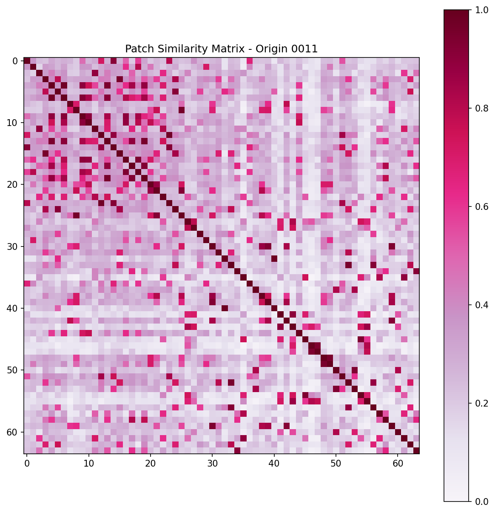
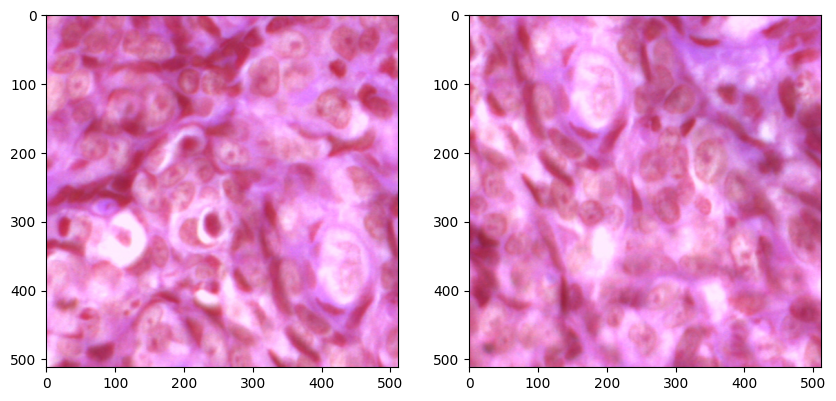

# Contamination Checks

This page records image-level checks used to inspect possible contamination, duplicate-like patches, and origin-patch matching behavior. These checks are exploratory quality-control material and should be reviewed before final fold publication.

## Purpose

The contamination checks are intended to answer practical data-organization questions:

- whether visually similar patches are duplicates or near-duplicates;
- whether patches can be traced back to the expected origin image;
- whether suspicious examples require exclusion, relabeling, or documentation;
- whether fold construction needs extra safeguards beyond origin-level grouping.

## Example Patch Comparison

The comparison below illustrates a suspicious or informative patch-pair case used during manual review.

## Origin Patch Grid

Patch grids help inspect whether patch samples align with the expected origin image.

## Similarity Matrix

Similarity matrices are used to spot unusually similar patch groups that may require manual inspection.

## Test Case

This test case is retained as an example of the contamination-check workflow.

## WIP Notes

The current figures live under `results/phase0_contamination_analysis/`. They are not final exclusion criteria by themselves. Before finalizing folds, confirm which suspicious cases are accepted, excluded, or documented, and make sure any decisions are reflected in the data dictionary and reproducibility notes.
