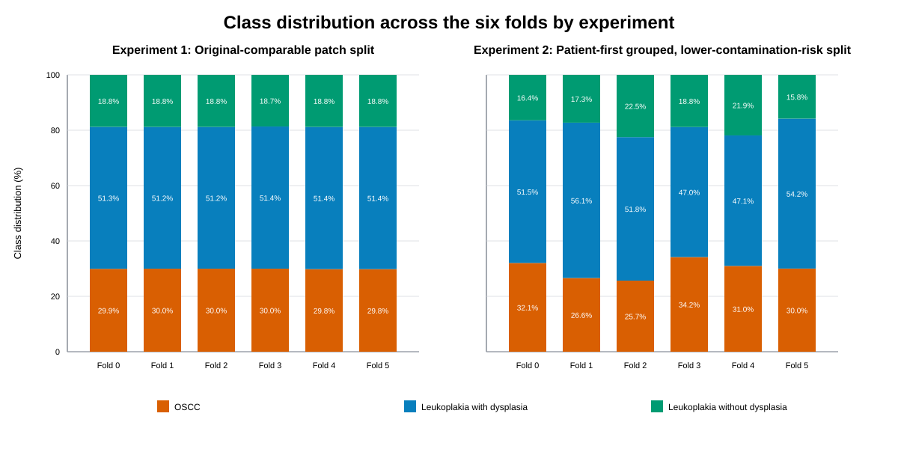
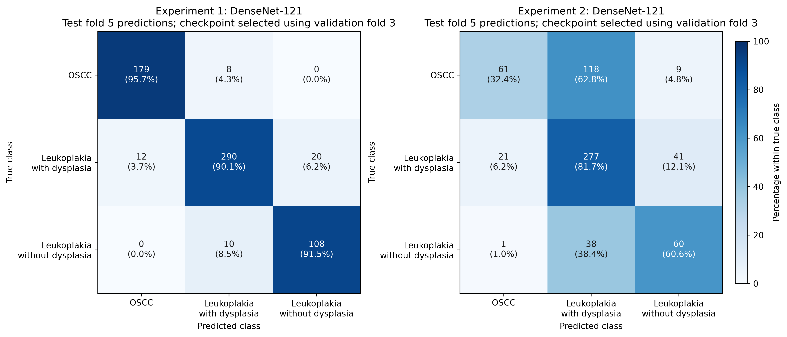
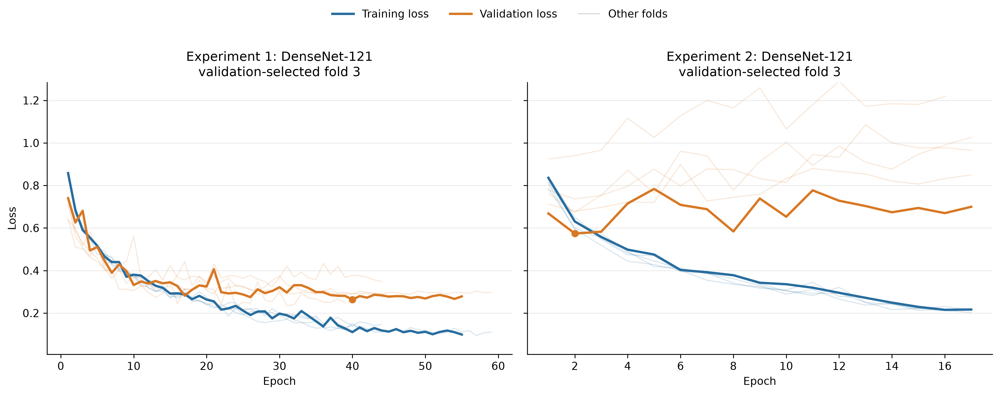

# Canonical Experiment Results

Last verified: 23 July 2026.

The final comparison evaluates the same three CNNs under two split strategies. The six canonical MLflow parent runs contain 30 finished child-fold runs. No models were retrained for this release: the public tables were verified from the stored child records.

## Held-Out Results

Values are mean ± population standard deviation across five checkpoints. Each checkpoint was trained with a different validation fold from folds 0–4 and then evaluated on the experiment's held-out fold 5.

| Experiment | Model | Balanced accuracy (%) | Macro precision (%) | Macro F1 (%) |
| --- | --- | ---: | ---: | ---: |
| Experiment 1 | MobileNetV2 | 90.57 ± 0.52 | 88.46 ± 1.10 | 89.37 ± 0.81 |
| Experiment 1 | **DenseNet-121** | **91.72 ± 0.50** | **90.16 ± 0.43** | **90.87 ± 0.40** |
| Experiment 1 | ResNet-50 | 89.86 ± 1.12 | 88.32 ± 0.98 | 88.98 ± 0.95 |
| Experiment 2 | MobileNetV2 | 57.07 ± 1.57 | 55.56 ± 3.66 | 54.99 ± 3.49 |
| Experiment 2 | **DenseNet-121** | **59.41 ± 3.18** | **59.12 ± 4.30** | **57.64 ± 2.82** |
| Experiment 2 | ResNet-50 | 59.27 ± 3.18 | 58.26 ± 5.21 | 57.36 ± 4.33 |

Balanced accuracy is the mean per-class recall, so it is mathematically equal to macro recall in this three-class implementation. The redundant recall column is omitted here; the machine-readable result table retains it as a consistency field.

The mean balanced-accuracy decrease from Experiment 1 to Experiment 2 is 33.50 percentage points for MobileNetV2, 32.31 for DenseNet-121, and 30.59 for ResNet-50. These mean differences are distinct from the median differences in the exploratory statistical table.

## Fold Distribution

Grouping changes the fold-level class proportions because source images contribute different numbers of patches. Both experiments nevertheless retain all 3,763 patches and the same overall class totals.

## Representative Confusion Matrices

DenseNet-121 was the highest-mean architecture in each experiment. Within that architecture, fold 3 was selected using validation balanced accuracy only; the held-out test result was not used to choose the representative checkpoint.

## Training And Validation Loss

Lighter curves show all five training rotations. Early stopping monitors validation loss, so folds can finish after different numbers of epochs.

## Exploratory Statistical Analysis

| Comparison | Test | Statistic | Raw p | Holm-adjusted p | Median difference | Interpretation |
| --- | --- | ---: | ---: | ---: | ---: | --- |
| Three CNNs within Experiment 1 | Friedman | 5.200 | 0.0743 | — | — | No architecture difference detected |
| Three CNNs within Experiment 2 | Friedman | 2.800 | 0.2466 | — | — | No architecture difference detected |
| MobileNetV2, Experiment 1 vs. 2 | Mann–Whitney U | 25.0 | 0.0079 | 0.0238 | 33.98 pp | Experiment 1 higher |
| DenseNet-121, Experiment 1 vs. 2 | Mann–Whitney U | 25.0 | 0.0079 | 0.0238 | 33.23 pp | Experiment 1 higher |
| ResNet-50, Experiment 1 vs. 2 | Mann–Whitney U | 25.0 | 0.0079 | 0.0238 | 30.31 pp | Experiment 1 higher |

These tests are exploratory. Only five checkpoint evaluations are available, their training subsets overlap, and each experiment reuses one held-out test fold. The split definition is the main experimental change, which supports an association between grouping and the performance decrease; the comparison does not prove that leakage alone caused every part of the decrease.

## Execution Time

Wall-clock totals include five cross-validation rotations and held-out evaluation:

| Experiment | MobileNetV2 | DenseNet-121 | ResNet-50 |
| --- | ---: | ---: | ---: |
| Experiment 1 | 177.9 min | 369.7 min | 311.2 min |
| Experiment 2 | 141.2 min | 330.1 min | 164.7 min |

The public research bundle contains only sanitized tables, figures, and provenance. It does not contain checkpoints, raw MLflow storage, private crosswalks, or LAB artifacts.
