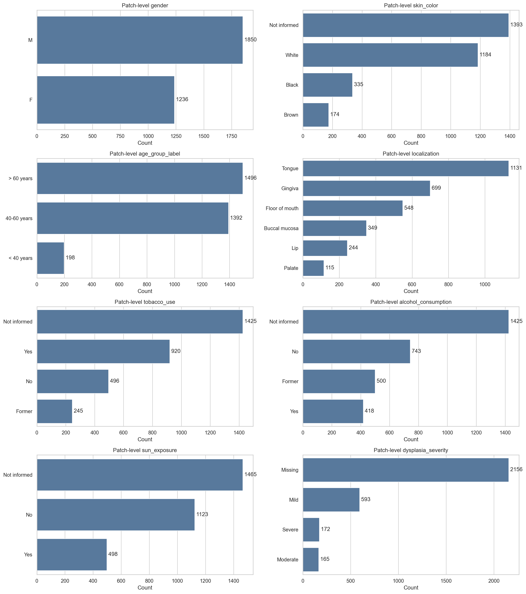

# Exploratory Analysis

This page collects exploratory dataset figures generated during the dataset organization work. These plots are descriptive: they document the available metadata, matched subset, missingness, and variable relationships used to decide what should be included in the public factsheet and what should not silently drive fold construction.

## Scope

The exploratory analysis currently covers:

- diagnosis distributions at origin and patch level;
- task label availability for Tasks II, III, and IV;
- demographic and clinical metadata distributions;
- missing and `Not informed` rates;
- diagnosis cross-tabs against available clinical variables;
- categorical association summaries.

The figures are used as audit material for documentation and fold-design decisions. They are not downstream model performance results.

## Diagnosis Matching

The matched subset links patch-level records back to origin-level metadata. Diagnosis matching is checked before fold design because folds must be assigned at origin level and then inherited by patches.

## Demographic and Clinical Metadata

The available metadata includes demographic fields and clinical risk-factor fields. These variables are documented in the public dataset factsheet, but they are not automatically suitable as fold-construction strata.

## Missingness

Missing and `Not informed` rates are checked separately at origin and patch level. Variables with high missingness should be treated carefully and usually remain descriptive unless explicitly promoted after review.

## Association Checks

Categorical association plots help identify relationships worth documenting and checking during fold review. These summaries should not be interpreted as causal evidence.

## Lesion Size

Lesion-size distributions are included as descriptive dataset context.

## WIP Notes

The exploratory figures are available in `results/dataset_statistics/`. The public docs include a representative subset so the documentation remains readable. Before publication, confirm that the figures correspond to the final matched subset and that any regenerated images are copied into `docs/assets/dataset_statistics/`.
