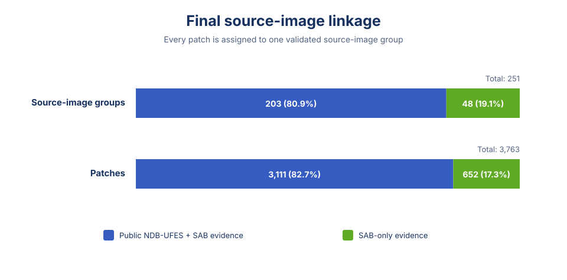
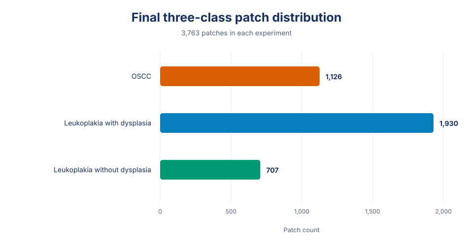
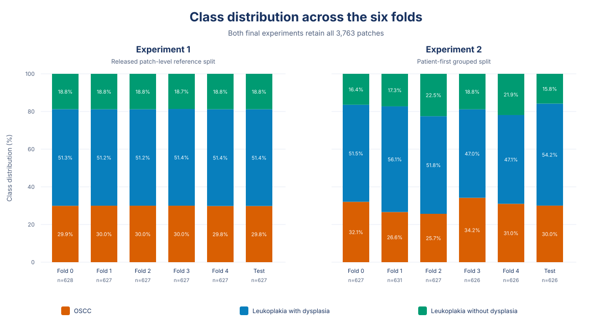
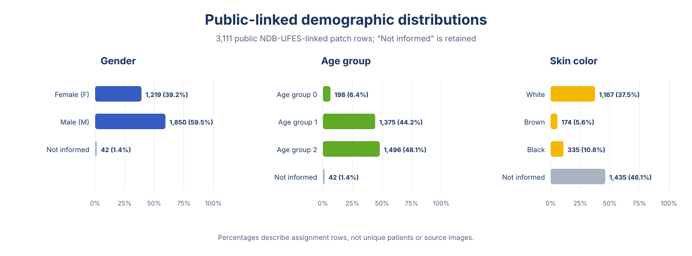
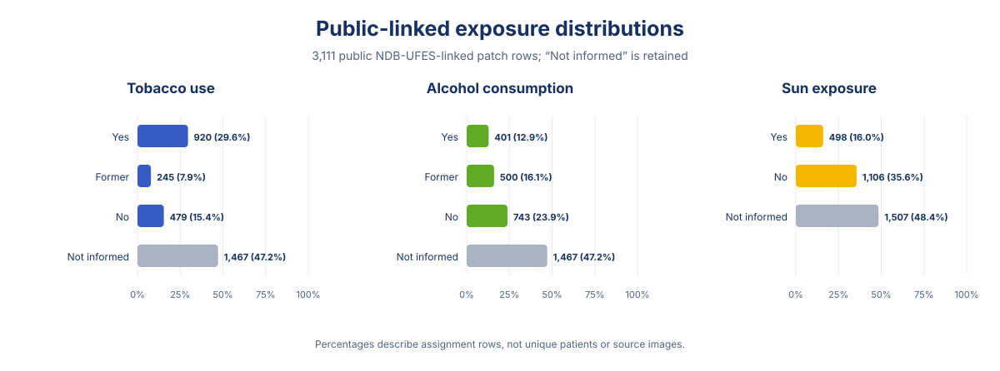
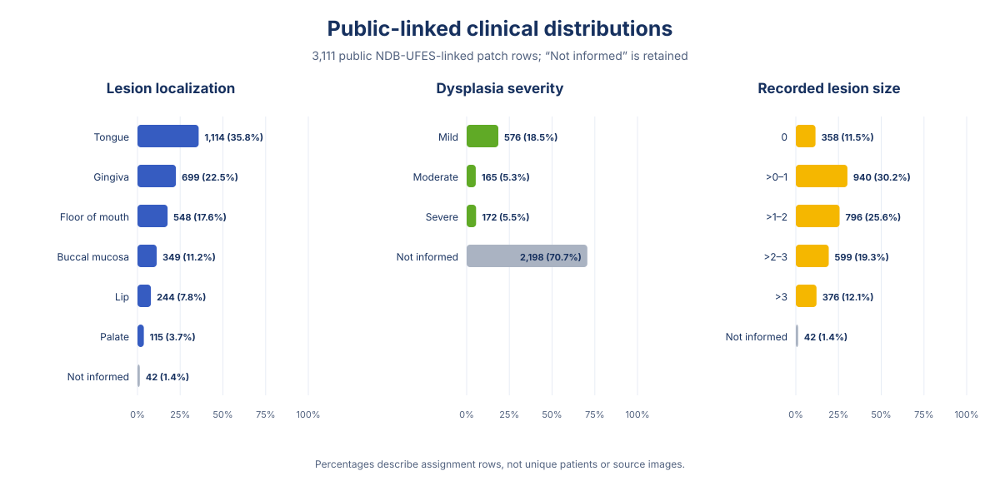

# Dataset Factsheet

This factsheet summarizes the final organized NDB-UFES experiment assignments, validated source-image linkage, labels, grouping rules, and reuse limits.

## Dataset Identity

Name: NDB-UFES Data Organizer final public outputs

Source dataset:

Falcao Ribeiro de Assis, Maria Clara. Lima, Leandro Muniz de. de Barros, Liliana Aparecida Pimenta. Velloso, Tania Regina. Krohling, Renato. Camisasca, Danielle. 2023. "NDB-UFES: An oral cancer and leukoplakia dataset composed of histopathological images and patient data." Mendeley Data, V4. doi: 10.17632/bbmmm4wgr8.4.

Public source page:

```text
https://data.mendeley.com/datasets/bbmmm4wgr8/4
```

Lab attribution:

[Nature-inspired Computing Lab, Labcin](https://www.researchgate.net/lab/Nature-inspired-Computing-Lab-Labcin-Renato-Krohling)

## Purpose

The repository publishes two final experiment assignments over the complete 3,763-patch P-NDB-UFES scope. It also provides a public-pseudonymous source-image index, canonical stored-run results, figures, provenance, and documentation for leakage-aware reuse.

Model training remains in a separate training repository. This repository contains the sanitized final outputs and the evidence needed to interpret them.

## Final Source-Image Linkage

SAB, coordinate, and pixel-containment evidence assign all 3,763 patches to 251 source-image groups.

| Source-image role | Groups | Patches | Interpretation |
| --- | ---: | ---: | --- |
| Public NDB-UFES + SAB evidence | 203 | 3,111 | The source image is supported by both public NDB-UFES and SAB evidence. |
| SAB-only evidence | 48 | 652 | The source image is recovered from SAB evidence without a public NDB-UFES source-image counterpart. |
| **Total** | **251** | **3,763** | Every patch has a validated source-image group. |

The 3,111 patches in both-source groups are the public NDB-UFES-linked set. The 652 SAB-only patches are retained in the final experiment scope and grouped by their validated source image.

The public source-image index contains one searchable row per group and excludes raw SAB case prefixes, original image names, and local filesystem paths.

<figure class="figure-panel" markdown>

<figcaption>Final source-image groups and patches by evidence role, generated from the public source-image index.</figcaption>
</figure>

## Final Experiments

Both experiments contain the same 3,763 patches and the same diagnostic totals:

| Diagnosis | Patches |
| --- | ---: |
| OSCC | 1,126 |
| Leukoplakia with dysplasia | 1,930 |
| Leukoplakia without dysplasia | 707 |

<figure class="figure-panel" markdown>

<figcaption>The same final diagnosis totals apply to both experiment assignments.</figcaption>
</figure>

Experiment 1 uses the released patch-level reference split. Experiment 2 uses patient-first grouping so linked patient/case and source-image groups remain within one fold. Experiment 2 is described as lower contamination risk because grouping known relationships cannot prove that every relationship in the source data has been recovered.

| Experiment | Fold counts, 0–5 | Source-image groups crossing folds | Patient/case groups crossing folds |
| --- | --- | ---: | ---: |
| Experiment 1 | 628/627/627/627/627/627 | 201 | 61 |
| Experiment 2 | 627/631/627/626/626/626 | 0 | 0 |

Folds 0–4 rotate as cross-validation folds. Fold 5 is the held-out test fold and is not used for training or validation.

<figure class="figure-panel" markdown>

<figcaption>Fold-level diagnosis shares generated directly from the two final public assignment CSVs.</figcaption>
</figure>

## Download the Fold CSVs

For leakage-aware reuse, download [Experiment 2: patient-first grouped fold assignments](https://raw.githubusercontent.com/beamaia/ndb_ufes_data_organizer/main/release/v1.0.0/public/tables/experiment2_patch_assignments.csv). For the released patch-level reference comparison, download [Experiment 1: reference fold assignments](https://raw.githubusercontent.com/beamaia/ndb_ufes_data_organizer/main/release/v1.0.0/public/tables/experiment1_patch_assignments.csv).

Both files contain 3,763 patch rows and the columns needed to select cross-validation folds 0–4 and held-out test fold 5.

## Diagnostic Labels

The final three-class task uses:

- oral squamous cell carcinoma (OSCC),
- leukoplakia with dysplasia,
- leukoplakia without dysplasia.

The source study also defines broader Task II and Task III labels. The final experiment tables use the Task IV three-class diagnosis for model evaluation.

## Patch-Row Distributions

These figures summarize the approved deidentified fields for the 3,111 public NDB-UFES-linked patch rows in both-source groups. They count patch rows rather than unique patients or source images, so source images that contribute more patches receive more weight. The 652 SAB-only rows are not included in these field-distribution charts. “Not informed” values remain visible and should not be interpreted as negative responses.

<figure class="figure-panel" markdown>

<figcaption>Gender, released age-group codes, and skin-color values across the 3,111 public NDB-UFES-linked patch rows.</figcaption>
</figure>

<figure class="figure-panel" markdown>

<figcaption>Tobacco-use, alcohol-consumption, and sun-exposure values across the 3,111 public NDB-UFES-linked patch rows.</figcaption>
</figure>

<figure class="figure-panel" markdown>

<figcaption>Lesion localization, dysplasia severity, and grouped recorded lesion-size values across the 3,111 public NDB-UFES-linked patch rows. Lesion-size bins preserve the released numeric values without inferring a unit.</figcaption>
</figure>

## Public Assignment Fields

Each final experiment table includes:

- public patch, origin, group, and source-image identifiers,
- diagnosis, fold, and fold role,
- repository-relative image path,
- source and metadata provenance,
- approved deidentified demographic and clinical fields.

Direct patient or lesion identifiers, private crosswalks, raw SAB identifiers, local absolute paths, and secrets are excluded.

## Leakage-Aware Usage

Required:

- use the released `fold` and `role` values,
- keep all rows sharing a final grouping identifier in the same partition,
- keep fold 5 held out during training and validation,
- report which experiment and folds were used.

Avoid:

- randomly resplitting patch rows,
- selecting a split after reviewing test performance,
- treating patches from the same source image or patient/case group as independent evaluation samples,
- describing Experiment 2 as contamination-free.

## Known Limits

- The 652 SAB-only patches do not have a public NDB-UFES source-image counterpart, although their SAB source-image grouping is validated.
- Some deidentified demographic and clinical fields contain substantial missingness and should not be treated as complete covariates.
- Grouping prevents known relationships from crossing folds but cannot establish that all possible relationships have been discovered.
- Contamination review remains conservative and should not be interpreted as a complete biological or forensic disposition.

## Recommended Citation Language

```text
The study used the public NDB-UFES dataset (Mendeley Data V4, doi: 10.17632/bbmmm4wgr8.4) with experiment assignments and validated source-image grouping published by the NDB-UFES Data Organizer. The patient-first experiment kept linked source-image and patient/case groups within one fold.
```
